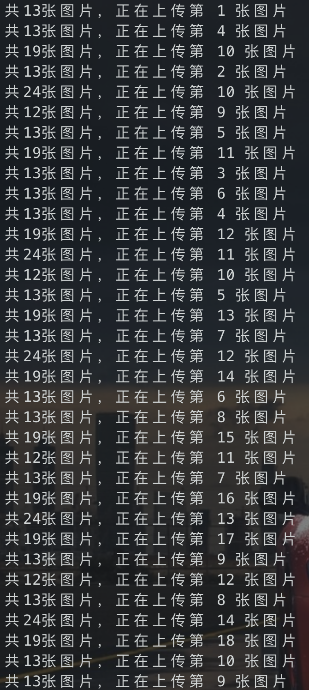

遇到一个问题，因为平时写markdown都是给图片存到本地的，但是有时候如果要给markdown传到一些平台上，比如语雀、微信公众号，这个时候本地的图片就不能用了，需要给图片全部上传到图床


效果如图：

```
   uploadImage

       ____ __           _____
  ____/ / // / ____ ___ <  / /______
 / __  / // /_/ __  __ \/ / __/ ___/
/ /_/ /__  __/ / / / / / / /_(__  )
\__,_/  /_/ /_/ /_/ /_/_/\__/____/

Usage: uploadImage -f xxx.md -wxsecret xxx -wxappid xxx
Usage: uploadImage -f xxx.md -smtoken xxx
Usage: uploadImage -f xxx.md -yuqueurl http://xxx -yuquecookie xxx

markdown图片自动上传到图床

Usage of uploadImage:
  -cover
    	是否覆盖源文件，默认不覆盖
  -d string
    	整个markdown文件夹路径
  -f string
    	单个markdown文件路径
  -p string
    	使用代理，如socks5://127.0.0.1:1080
  -smtoken string
    	sm.ms的token
  -t int
    	线程数量，仅会在多文件时使用 (default 3)
  -wxappid string
    	微信公众号appid
  -wxsecret string
    	微信公众号secret
  -yuquecookie string
    	语雀上传的Cookie
  -yuqueurl string
    	语雀上传的URL
```


批量上传测试：




---


文件目录结构：

```
.
├── README.assets
│   ├── image-20220130234617141.png
│   └── image-20220131113440064.png
├── README.md
├── build.sh
├── go.mod
├── go.sum
├── main.go
├── release
│   ├── uploadImage.exe
│   ├── uploadImage_amd_linux
│   └── uploadImage_darwin
└── test
    ├── 01.利用SourceMap还原前端js代码.md
    ├── 01.利用SourceMap还原前端js代码.md.txt
    └── 利用SourceMap还原前端js代码.assets
        ├── image-20200928214529136.png
        └── image-20200929223206583.png
```

## 安装

支持`go get`安装

```shell
go get github.com/damit5/uploadImage
```

也可以用`release`目录下已编译好的

## 更新

- [x] 2022/01/31: 添加支持sm.ms
- [x] 2022/02/07: 修复几个bug；注意：sm.ms一分钟最多上传20张图片，一小时最多上传100张图
- [x] 2022/03/11: 增加yuque支持，手动在web上传图片抓包，然后拿到上传的URL和cookie即可