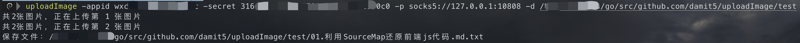

遇到一个问题，因为平时写markdown都是给图片存到本地的，但是有时候如果要给markdown传到一些平台上，比如语雀、微信公众号，这个时候本地的图片就不能用了，需要给图片全部上传到图床


所以写了个自动解析markdown图片并上传内容到微信公众号图床的


效果如图：

```
>>> uploadImage
markdown图片自动上传到图床
Usage of uploadImage:
  -appid string
    	微信公众号appid
  -cover
    	是否覆盖源文件，默认不覆盖
  -d string
    	整个markdown文件夹路径
  -f string
    	单个markdown文件路径
  -p string
    	使用代理，如socks5://127.0.0.1:1080
  -secret string
    	微信公众号secret
  -t int
    	线程数量，仅会在多文件时使用 (default 3)
```





---


文件目录结构：

```
.
├── README.assets
│   └── image-20220130234617141.png
├── README.md
├── go.mod
├── go.sum
├── main.go
├── release
│   ├── uploadImage.exe
│   ├── uploadImage_darwin
│   └── uploadImage_linux_amd
└── test
    ├── 01.利用SourceMap还原前端js代码.md
    ├── 01.利用SourceMap还原前端js代码.md.txt
    └── 利用SourceMap还原前端js代码.assets
        ├── image-20200928214529136.png
        └── image-20200929223206583.png
```


支持`go get`安装

```shell
go get github.com/damit5/uploadImage
```

